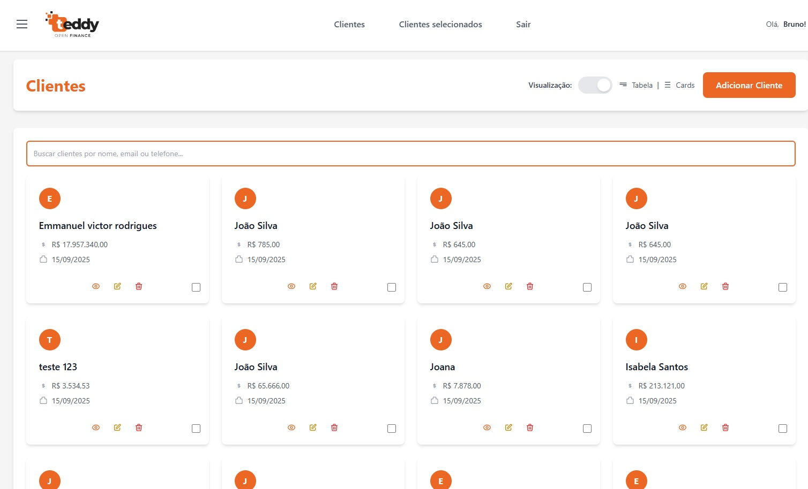

# Sistema de Gerenciamento de Clientes - Fintech

Este projeto foi desenvolvido como parte de um **teste técnico** para demonstrar habilidades em desenvolvimento frontend com React, TypeScript e arquitetura de microfrontends.



## 📋 Sobre o Projeto

O sistema é uma aplicação web para gerenciamento de clientes de uma fintech, construída com uma arquitetura de microfrontends que permite modularidade e escalabilidade. A aplicação consome uma API REST externa para realizar operações CRUD completas.

### 🎯 Funcionalidades Principais

#### ✅ CRUD Completo de Clientes
- **Create (Criar)**: Cadastro de novos clientes com validação de dados
- **Read (Ler)**: Listagem paginada de clientes com busca e filtros
- **Update (Atualizar)**: Edição de informações dos clientes existentes
- **Delete (Deletar)**: Remoção de clientes com confirmação via modal

#### 🔄 Consumo de API
- **Endpoint Base**: `https://boasorte.teddybackoffice.com.br`
- **Operações Disponíveis**:
  - `GET /users` - Listar clientes com paginação
  - `GET /users/:id` - Buscar cliente específico
  - `POST /users` - Criar novo cliente
  - `PUT /users/:id` - Atualizar cliente
  - `DELETE /users/:id` - Deletar cliente

#### 📱 Interface e Experiência do Usuário
- **Visualizações Múltiplas**: Modo tabela e cards para listagem
- **Seleção de Clientes**: Sistema de seleção múltipla com persistência
- **Busca em Tempo Real**: Filtro por nome dos clientes
- **Paginação**: Navegação eficiente entre páginas
- **Responsividade**: Interface adaptável para diferentes dispositivos
- **Modais de Confirmação**: Confirmações para ações críticas como exclusão

#### 🏗️ Arquitetura de Microfrontends
- **Home**: Dashboard principal com resumo
- **Clientes**: Gerenciamento completo de clientes
- **Clientes Selecionados**: Visualização e gestão de clientes marcados
- **Detalhes do Cliente**: Visualização detalhada individual
- **Autenticação**: Sistema de login e controle de acesso

## 🛠️ Tecnologias Utilizadas

### Frontend
- **React 18** - Biblioteca principal para UI
- **TypeScript** - Tipagem estática e melhor DX
- **Vite** - Build tool moderna e rápida
- **React Router DOM** - Roteamento SPA
- **Tailwind CSS** - Framework CSS utilitário

### Gerenciamento de Estado
- **Zustand** - Store global leve e performático
- **Persistência** - Dados mantidos no localStorage

### Qualidade de Código
- **ESLint** - Linting e padronização
- **TypeScript Strict Mode** - Verificação rigorosa de tipos
- **Componentes Modulares** - Arquitetura componentizada

## 🚀 Como Executar o Projeto

### Pré-requisitos
- Node.js (versão 16 ou superior)
- npm ou yarn

### Instalação e Execução

1. **Clone o repositório**
```bash
git clone <url-do-repositorio>
cd Teste_fintech
```

2. **Instale as dependências**
```bash
npm install
```

3. **Execute o projeto em modo desenvolvimento**
```bash
npm run dev
```

4. **Acesse a aplicação**
```
http://localhost:5173
```

### Scripts Disponíveis

```bash
npm run dev      # Executa em modo desenvolvimento
npm run build    # Gera build de produção
npm run preview  # Visualiza build de produção
npm run lint     # Executa verificação de código
```

## 📁 Estrutura do Projeto

```
src/
├── components/          # Componentes compartilhados
│   ├── Header.tsx
│   ├── Sidebar.tsx
│   └── Pagination.tsx
├── microfrontends/      # Módulos da aplicação
│   ├── auth/           # Autenticação
│   ├── clients/        # Gerenciamento de clientes
│   ├── client-detail/  # Detalhes do cliente
│   ├── home/           # Dashboard principal
│   └── selected-clients/ # Clientes selecionados
├── hooks/              # Custom hooks
│   └── useClientApi.ts # Hook para API de clientes
├── store/              # Gerenciamento de estado
│   ├── clientStore.ts
│   ├── selectedClientsStore.ts
│   └── userStore.ts
├── types/              # Definições TypeScript
│   └── Client.ts
└── assets/             # Recursos estáticos
```

## 🔧 Funcionalidades Técnicas Implementadas

### Gerenciamento de Estado
- **Zustand Stores** para diferentes domínios (clientes, usuário, seleções)
- **Persistência automática** de clientes selecionados
- **Estado reativo** com atualizações em tempo real

### Integração com API
- **Custom Hook** (`useClientApi`) para centralizar chamadas
- **Tratamento de erros** robusto com feedback visual
- **Loading states** para melhor UX
- **Paginação** integrada com backend

### Interface de Usuário
- **Design System** consistente com Tailwind CSS
- **Componentes reutilizáveis** e modulares
- **Feedback visual** para todas as ações
- **Validação de formulários** em tempo real

## 🎨 Padrões de Design Implementados

- **Atomic Design** - Componentes organizados hierarquicamente
- **Container/Presenter** - Separação de lógica e apresentação
- **Custom Hooks** - Reutilização de lógica de estado
- **TypeScript First** - Tipagem completa da aplicação

## 📊 Dados do Cliente

Cada cliente possui as seguintes informações:
- **ID**: Identificador único
- **Nome**: Nome completo do cliente
- **Salário**: Valor do salário mensal
- **Valor da Empresa**: Avaliação da empresa do cliente
- **Data de Criação**: Timestamp de cadastro
- **Data de Atualização**: Timestamp da última modificação

## 🔐 Considerações de Segurança

- **Validação de dados** no frontend e backend
- **Sanitização de inputs** para prevenir XSS
- **Tratamento seguro de erros** sem exposição de dados sensíveis
- **Controle de acesso** baseado em autenticação

---

**Desenvolvido como teste técnico demonstrando competências em React, TypeScript, consumo de APIs REST e arquitetura de microfrontends.**
